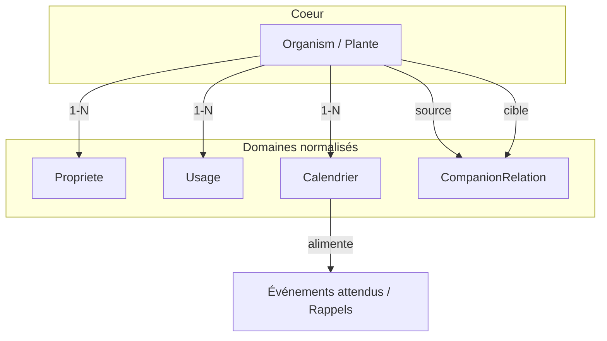

# Plan : Base espèces riche (qualité type tisanji.com)

## Objectif

Atteindre une base de données d’espèces **très riche**, de niveau **[tisanji.com/fiches](https://tisanji.com/fiches)** : fiches complètes avec zones de rusticité, propriétés du sol, usages (comestible, médicinal, bois), calendrier (floraison, récolte), compagnonnage, et permettre **rappels / événements attendus** (ex. « Floraison attendue : mai–juin » pour un pommier).

---

## 1. Mapping type de donnée → source recommandée

D’après votre tableau (et les sources déjà prévues) :

| Type de donnée | Source recommandée | Tables / champs cibles |
|----------------|--------------------|------------------------|
| **Dimensions & Sécurité** | Hydro-Québec | `Organism` (hauteur_max, largeur_max, etc.) / propriétés |
| **Rusticité & Sol** | Végépédia / USDA | `plantes.zone_rusticite` ; `proprietes` (sol, pH, ombre) |
| **Comestibilité / Usages** | PFAF | `usages` (comestible, médicinal, bois) |
| **Statut indigène** | VASCAN (Canadensys) | `Organism.indigene` + `data_sources['vascan']` |
| **Maladies & Ravageurs** | Espace pour la vie / MAPAQ | Nouvelle table ou champ `maladies_ravageurs` / `data_sources` |

À conserver : Hydro-Québec, PFAF, VASCAN, USDA/ITIS (TSN), Ville de Québec, Ville de Montréal, et **à ajouter** : Végépédia (si dispo), Espace pour la vie / MAPAQ pour maladies et ravageurs.

---

## 1bis. Stratégie base complète (priorité des sources)

**Contexte cible :** Mont Caprice, zone 4a, Québec — arbres fruitiers, vivaces comestibles, permaculture (app utilisable printemps 2026).

La complétude repose sur un **pipeline cohérent**, pas sur l’ajout d’une source en priorité :

| Objectif | Source principale |
|----------|-------------------|
| **Volume d’espèces** | Hydro-Québec (~1700) ou VASCAN `--file` (export Checklist builder) pour plus d’espèces |
| **Rusticité / sol / dimensions** | Hydro-Québec (prioritaire) |
| **Usages / comestible / médicinal** | PFAF |
| **Identifiants taxonomiques** | VASCAN `--enrich`, USDA `--enrich` (éviter doublons) |
| **Enrichissement marginal** | Botanipedia (catalogue limité, surtout Espagne) — optionnel, ne pas en faire le pilier |

**Pipeline d’import recommandé :**

1. Créer/étendre le catalogue (Hydro-Québec ou VASCAN `--file`).
2. Enrichir (VASCAN `--enrich`, USDA `--enrich`, PFAF).
3. Merge doublons.
4. `populate_proprietes_usage_calendrier`.

Référence : [docs/sources-donnees.md](docs/sources-donnees.md) (ordre des imports, création vs enrichissement).

---

## 2. Schéma en cinq domaines (tables relationnelles)

L’idée est d’**étendre** le modèle actuel avec des **tables dédiées** par domaine, tout en gardant `Organism` comme entité centrale « plante » (clé : `nom_latin` + `tsn` / `vascan_id`). Les relations permettent ensuite des requêtes ciblées, des imports par source et une évolution vers des rappels basés sur le calendrier.

### 2.1 Plantes (coeur)

- **Table** : `Organism` actuel, renommé conceptuellement « plante » dans la doc / UI.
- **Clés** :
  - `nom_latin` : unique (ou unique_together avec nom_commun selon contrainte actuelle).
  - `tsn` (ITIS) et `vascan_id` (VASCAN) : index uniques, optionnels, pour lier sans doublon aux fiches USDA/VASCAN.
- **Champs principaux** : `nom_latin`, `nom_commun`, `famille`, `regne`, `type_organisme`, `zone_rusticite` (JSON par source), `data_sources`, `indigene`, etc.
- **Sources** : Hydro-Québec (dimensions, sécurité), VASCAN (statut indigène, noms), USDA (rusticité), Ville de Québec / Montréal (présence en inventaire).

### 2.2 Propriétés (sol, pH, ombre)

- **Nouvelle table** : `OrganismPropriete` (ou `Propriete`) avec `ForeignKey(Organism)`.
- **Champs typiques** :
  - `type_sol` : choix multiples ou JSON (sablonneux, argileux, limoneux, loameux, etc.).
  - `ph_min`, `ph_max` ou `ph_list` (ex. acide à neutre).
  - `tolerance_ombre` : choix (plein soleil, mi-ombre, ombre).
  - `source` : hydroquebec, usda, vascan, manuel, etc.
- **Relation** : 1–N (plusieurs lignes par organisme si on veut une ligne par source) ou 1–1 avec champs multi-valeurs (JSON/liste).
- **Sources** : Végépédia, USDA, Hydro-Québec (déjà partiellement en `sol_textures`, `sol_ph`, `besoin_soleil` sur `Organism` ; migration possible vers cette table ou fusion progressive).

### 2.3 Usages (comestible, médicinal, bois)

- **Nouvelle table** : `OrganismUsage` (ou `Usage`) avec `ForeignKey(Organism)`.
- **Champs typiques** :
  - `type_usage` : choix (comestible_fruit, comestible_feuille, comestible_racine, medicinal, bois_oeuvre, artisanat, etc.).
  - `parties` : texte ou liste (ex. « fruit, feuille »).
  - `description` : texte libre.
  - `source` : pfaf, manuel, etc.
- **Relation** : 1–N (plusieurs usages par plante).
- **Sources** : PFAF en priorité ; à compléter depuis livres/permaculture en open data si disponible.

### 2.4 Calendrier (floraison, récolte)

- **Nouvelle table** : `OrganismCalendrier` (ou `Calendrier`) avec `ForeignKey(Organism)`.
- **Champs typiques** :
  - `type_periode` : floraison, fructification, recolte, semis, etc.
  - `mois_debut`, `mois_fin` : entiers 1–12 (optionnel : jour pour précision).
  - `source` : pfaf, hydroquebec, usda, manuel.
- **Relation** : 1–N (plusieurs périodes par plante, ex. floraison mai–juin, récolte sept–oct).
- **Usage** :
  - Affichage « Floraison attendue : mai–juin », « Récolte : septembre–octobre » sur la fiche espèce.
  - **Événements attendus** : à partir de ces mois, l’app peut proposer des « événements attendus » (ex. « Floraison habituelle pour Pommier ») ou créer des **rappels** (Reminder) suggérés (ex. « Cueillette pommes – septembre ») liés au spécimen de l’utilisateur.
- **Sources** : PFAF (`periode_recolte` actuel), Hydro-Québec, USDA, VASCAN si disponible.

### 2.5 Compagnonnage

- **Table existante** : `CompanionRelation` (`organisme_source`, `organisme_cible`, `type_relation`, `description`, `source_info`).
- **À faire** : alimentation depuis PFAF et, si possible, livres/permaculture en open data ; garder la trace de la source dans `source_info` ou un champ `source` dédié.

---

## 3. Événements attendus et rappels

- **Événements réels** : restent sur `Event` (lié au `Specimen`) : l’utilisateur enregistre « Floraison observée le 15 mai », « Récolte le 20 septembre ».
- **Calendrier espèce** : `OrganismCalendrier` décrit les **périodes typiques** (mois) par espèce.
- **Rappels** :
  - **Rappels utilisateur** : `Reminder` (lié au `Specimen`) comme aujourd’hui (ex. « Me rappeler la taille en mars »).
  - **Rappels / événements suggérés** : à partir de `OrganismCalendrier` + les spécimens du jardin (ou favoris), l’app peut :
    - Afficher « Ce mois-ci : floraison attendue (Pommier, Lilas…), récolte attendue (Pomme, Poire…) ».
    - Proposer de créer un `Reminder` ou un `Event` type « floraison » / « récolte » pour un spécimen donné, avec une date par défaut basée sur les mois du calendrier (ex. 15 mai pour « floraison mai–juin »).

Aucun changement obligatoire du modèle `Event` ou `Reminder` : on s’appuie sur une couche « expected events » dérivée de `OrganismCalendrier` (API ou vue « ce mois : floraisons / récoltes attendues »).

---

## 4. TSN / VASCAN et multi-sources (rappel)

- **Organism** : ajout des champs `tsn` (PositiveIntegerField, unique, nullable) et `vascan_id` (PositiveIntegerField, unique, nullable).
- **Matching** : dans `find_or_match_organism()`, priorité : 1) `vascan_id`, 2) `tsn`, 3) `nom_latin` / `nom_commun`.
- **Nouvelles sources** : VASCAN, USDA/ITIS, Ville de Québec, Ville de Montréal, et (recommandé) Espace pour la vie / MAPAQ pour maladies et ravageurs.

---

## 4bis. Import Hydro-Québec (nettoyage, slug unique, création)

Pour renforcer la robustesse de l’import Hydro-Québec, le flux applique trois étapes avant création/matching :

1. **Nettoyer les noms** : trim, normalisation des espaces multiples, et corrections optionnelles (dict `NOM_LATIN_CORRECTIONS` dans la commande pour fautes connues).
2. **Générer un `slug_latin` unique** : à partir du nom latin nettoyé, avec suffixe numérique en cas de collision (`get_unique_slug_latin` dans `species/source_rules.py`).
3. **Chercher ou créer l’entrée** : `find_or_match_organism(..., defaults={..., 'slug_latin': slug_latin_unique})` ; le `slug_latin` fourni dans `defaults` est propagé à la création.

Implémentation : [species/management/commands/import_hydroquebec.py](species/management/commands/import_hydroquebec.py) (`_clean_import_names`, appel à `get_unique_slug_latin`, puis `find_or_match_organism`).

---

## 4ter. Exposition API et fiche espèce mobile

- **API détail organisme** : exposer les champs dérivés des tables relationnelles `OrganismPropriete`, `OrganismUsage`, `OrganismCalendrier`, `CompanionRelation` (champs `proprietes`, `usages`, `calendrier`, `compagnons`) dans le serializer de détail organisme, avec Prefetch pour éviter N+1.
- **Fiche espèce mobile** : afficher ces blocs (propriétés sol/pH/ombre, usages, calendrier floraison/récolte/semis, compagnons) dans [mobile/app/species/[id].tsx](mobile/app/species/[id].tsx).

---

## 5. Ordre de mise en œuvre suggéré

1. **Identifiants taxonomiques** : migration ajoutant `tsn` et `vascan_id` à `Organism` ; extension de `find_or_match_organism`.
2. **Nouvelles tables** : créations des modèles `OrganismPropriete`, `OrganismUsage`, `OrganismCalendrier` + migrations.
3. **Migration des données existantes** : déplacement progressif des champs actuels d’`Organism` (sol, usages, periode_recolte) vers les nouvelles tables, avec source « hydroquebec » / « pfaf » / « manuel » selon l’origine.
4. **Imports multi-sources** : VASCAN, USDA, Arbres Québec/Montréal, et ajout Maladies & Ravageurs (Espace pour la vie / MAPAQ) dans `data_sources` ou table dédiée.
5. **Calendrier → UX** : API ou vues « événements attendus ce mois » ; proposition de rappels basés sur le calendrier espèce.
6. **Compagnonnage** : enrichissement PFAF + open data permaculture, avec source tracée.

---

## 6. Fichiers impactés (résumé)

| Fichier | Action |
|---------|--------|
| `species/models.py` | Ajout `tsn`, `vascan_id` ; nouveaux modèles `OrganismPropriete`, `OrganismUsage`, `OrganismCalendrier` |
| `species/source_rules.py` | Constantes sources, `find_or_match_organism(tsn=..., vascan_id=...)`, `get_unique_slug_latin` |
| `species/migrations/` | 0030_organism_tsn_vascan_id ; 0031_propriete_usage_calendrier (ou 3 migrations séparées) |
| `species/management/commands/` | import_vascan, import_usda, import_arbres_quebec, import_arbres_montreal ; import_hydroquebec (nettoyage noms, slug_latin unique) ; import_pfaf pour remplir nouvelles tables |
| `species/admin.py` | Inlines ou onglets pour Propriete, Usage, Calendrier ; affichage tsn / vascan_id |
| API / vues | Détail organisme : champs `proprietes`, `usages`, `calendrier`, `compagnons` ; endpoints « événements attendus » (par mois, par jardin/favoris) et suggestion de rappels |
| `mobile/app/species/[id].tsx` | Affichage des blocs propriétés, usages, calendrier, compagnons sur la fiche espèce |

Ce plan garde la compatibilité avec le modèle actuel (Specimen → Organism, Event, Reminder) tout en ouvrant la voie à une base « fiches plantes » riche, multi-sources et exploitable pour les rappels et événements attendus (floraison, récolte).
